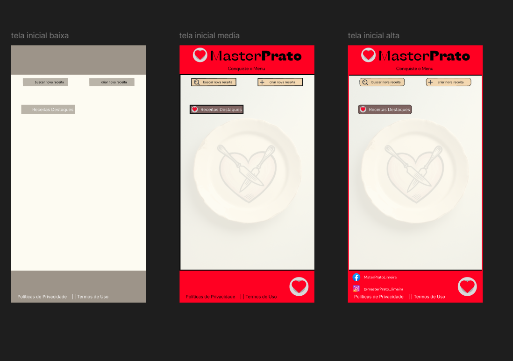

### **Escopo do Projeto**

**Funcionalidades Principais:**
1. **Autenticação e Autorização:**
   - Registro e login de usuários usando JWT.
   - Gerenciamento de perfil do usuário.

2. **Gerenciamento de Eventos:**
   - Criação, edição, visualização e exclusão de eventos.
   - Listagem e pesquisa de eventos.

3. **Inscrição em Eventos:**
   - Inscrição e cancelamento de inscrição em eventos. Disponível para todos, incluindo usuários não autenticados.
   - Visualização dos eventos em que o usuário está inscrito. Disponível apenas para usuários autenticados.

4. **Notificações:**
   - Envio de lembretes e atualizações sobre eventos.

5. **Interface de Administração (Opcional):**
   - Painel para gerenciar eventos e visualizar inscrições.

---

### **Funcionalidades Adicionais:**

1. **Inscrição Aberta para Qualquer Pessoa:**
   - **Descrição:** Qualquer pessoa, mesmo não autenticada, pode se inscrever em eventos disponíveis. No entanto, para gerenciar suas inscrições e visualizar eventos nos quais está inscrito, o usuário precisa estar autenticado.

2. **Visualização dos Eventos em que o Usuário Está Inscrito:**
   - **Descrição:** Usuários autenticados podem visualizar uma lista dos eventos nos quais estão inscritos em seu perfil.

---

### **Objetivos SMART**

1. **Específico:** Desenvolver uma aplicação web para gestão de eventos que permita a criação, visualização e inscrição em eventos, com funcionalidades de autenticação e gerenciamento de usuários.
   
2. **Mensurável:** A aplicação deve ter pelo menos 80% das funcionalidades testadas e funcionando corretamente, incluindo CRUD de eventos, gerenciamento de inscrições e autenticação de usuários.

3. **Atingível:** Utilizar Node.js, React, MongoDB e JWT para construir a aplicação. O desenvolvimento será realizado em um ambiente de trabalho colaborativo com um cronograma definido.

4. **Relevante:** A aplicação atende à necessidade de gerenciar eventos de forma eficiente e segura, o que é um requisito comum para muitas organizações e indivíduos.

5. **Temporal:** Concluir o projeto em 8 semanas, com fases de desenvolvimento, testes e ajustes finais.

---

### **Cronograma - Diagrama de Gantt**

**Semana 1:**
- Planejamento e definição de requisitos.
- Configuração do ambiente de desenvolvimento.

**Semana 2:**
- Desenvolvimento da API backend (Node.js/Express).
- Configuração do banco de dados (MongoDB).

**Semana 3:**
- Implementação da autenticação e autorização (JWT).
- Desenvolvimento das rotas principais para eventos e usuários.

**Semana 4:**
- Desenvolvimento do frontend (React) - estrutura inicial e páginas principais.
- Integração frontend com backend.

**Semana 5:**
- Implementação das funcionalidades de inscrição e gerenciamento de eventos.
- Desenvolvimento de notificações e lembretes.

**Semana 6:**
- Testes unitários e integração.
- Ajustes baseados nos testes.

**Semana 7:**
- Prototipagem final e ajustes na UI/UX.
- Preparação para deploy.

**Semana 8:**
- Deploy da aplicação.
- Revisão final e documentação.

---

### **Análise de Risco e Mitigação**

1. **Problemas de Autenticação:**
   - **Risco:** Falhas na autenticação podem impedir o acesso dos usuários à aplicação ou comprometer a segurança.
   - **Mitigação:**
     - **Uso de Bibliotecas Confiáveis:** Utilizar bibliotecas bem estabelecidas para autenticação e criptografia, como jsonwebtoken para JWT e bcrypt para hash de senhas.
     - **Testes Abrangentes:** Implementar testes unitários e de integração para verificar a robustez da autenticação e autorização.
     - **Implementação de Protocolos de Segurança:** Garantir que o processo de login e registro esteja protegido contra ataques como força bruta e injeção SQL.

2. **Problemas de Performance:**
   - **Risco:** A aplicação pode enfrentar lentidão ou falhas se não for otimizada corretamente, especialmente com um grande número de usuários ou eventos.
   - **Mitigação:**
     - **Otimização de Consultas:** Utilizar índices adequados no MongoDB para melhorar a performance das consultas.
     - **Cache de Dados:** Implementar caching para dados que não mudam frequentemente, usando soluções como Redis.
     - **Análise de Performance:** Monitorar a performance da aplicação e identificar gargalos usando ferramentas como New Relic ou o módulo performance do Node.js.

3. **Segurança:**
   - **Risco:** Vulnerabilidades na aplicação podem expor dados sensíveis ou permitir acessos não autorizados.
   - **Mitigação:**
     - **Validação de Dados:** Implementar validação robusta de entradas no frontend e backend para prevenir injeções e ataques de XSS.
     - **Criptografia de Dados Sensíveis:** Utilizar criptografia para dados sensíveis, como senhas e informações pessoais.
     - **Auditoria e Monitoramento:** Realizar auditorias de segurança e monitorar logs para detectar e responder rapidamente a atividades suspeitas.

4. **Integração Frontend e Backend:**
   - **Risco:** Problemas na integração entre frontend e backend podem resultar em falhas na comunicação ou em funcionalidades quebradas.
   - **Mitigação:**
     - **Desenvolvimento Ágil e Iterativo:** Trabalhar em ciclos curtos de desenvolvimento e integração contínua para detectar e corrigir problemas rapidamente.
     - **Documentação de API:** Criar e manter uma documentação clara e detalhada das APIs utilizando ferramentas como Swagger ou Postman.
     - **Testes de Integração:** Implementar testes de integração para verificar se o frontend e backend estão funcionando corretamente juntos.

5. **Gerenciamento de Dependências:**
   - **Risco:** Dependências desatualizadas ou conflitantes podem introduzir vulnerabilidades ou bugs na aplicação.
   - **Mitigação:**
     - **Atualizações Regulares:** Manter todas as dependências atualizadas e utilizar ferramentas como npm audit para identificar e corrigir vulnerabilidades.
     - **Controle de Versões:** Utilizar um gerenciador de pacotes e especificar versões exatas das dependências no arquivo package.json para evitar conflitos.
     - **Testes Automatizados:** Implementar uma suíte de testes automatizados para garantir que atualizações nas dependências não quebrem funcionalidades existentes.

6. **Problemas de Usabilidade:**
   - **Risco:** A aplicação pode não ser intuitiva ou fácil de usar, impactando negativamente a experiência do usuário.
   - **Mitigação:**
     - **Prototipagem e Testes de Usabilidade:** Criar protótipos e realizar testes com usuários para identificar e resolver problemas de usabilidade antes do desenvolvimento final.
     - **Feedback Contínuo:** Coletar feedback dos usuários e realizar melhorias contínuas com base nas necessidades e sugestões deles.
     - **Design Responsivo:** Garantir que a interface seja responsiva e funcione bem em diferentes dispositivos e tamanhos de tela.

7. **Problemas de Escalabilidade:**
   - **Risco:** A aplicação pode ter dificuldades para escalar e suportar um número crescente de usuários e eventos.
   - **Mitigação:**
     - **Arquitetura Escalável:** Projetar a aplicação com uma arquitetura escalável, como o uso de microservices ou containers (Docker).
     - **Monitoramento e Planejamento:** Monitorar o desempenho da aplicação e planejar a escalabilidade horizontal (adicionando mais instâncias) e vertical (aumentando os recursos das instâncias existentes).
     - **Load Balancing:** Implementar balanceamento de carga para distribuir o tráfego de usuários de maneira eficiente.

---

### **Recursos**

1. **Equipe:**
   - Desenvolvedor Backend (Node.js)
   - Desenvolvedor Frontend (React)
   - Designer UI/UX (opcional)
   - Testador (opcional)

2. **Tecnologias:**
   - Node.js, Express, MongoDB, JWT
   - React, Axios
   - Mongoose, Bcrypt

3. **Ferramentas:**
   - GitHub para controle de versão.
   - Trello ou Jira para gerenciamento de tarefas.
   - Postman para testes de API.
   - Heroku ou Vercel para deploy (opcional).

---

### **Diagramas**

# Sistema de Gestão de Eventos

## Diagrama de Caso de Uso

## Diagrama de Classe

## Diagrama de Fluxo

## Prototipos

