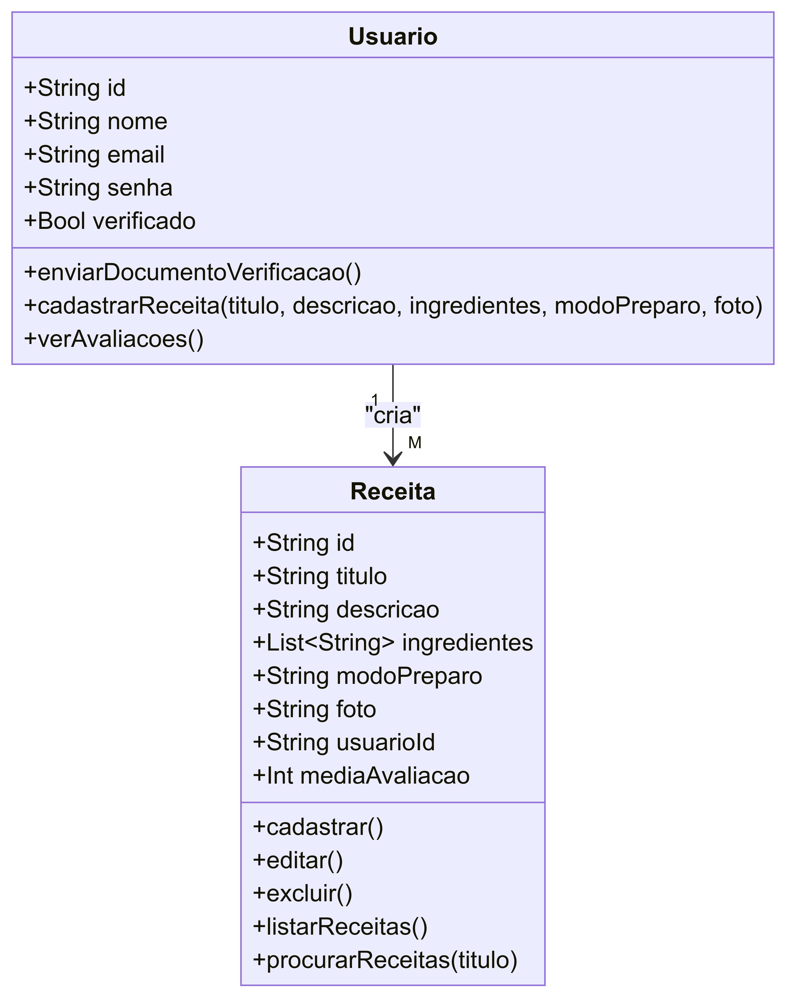

### **Blog de Receitas para Restaurante**

#### **Objetivo:**

Desenvolver uma plataforma onde usuários verificados possam cadastrar suas receitas, que serão avaliadas pela cozinha do restaurante. A receita com a melhor avaliação será incluída no menu do restaurante.

---

### **Por que Este Projeto?**

Este projeto permite uma interação direta entre o restaurante e seus clientes, oferecendo uma oportunidade para os clientes verem suas criações no menu. A plataforma possibilita que o restaurante inove constantemente, incorporando novas receitas e mantendo o engajamento com os clientes.

---

### **Escopo do Projeto**

**Funcionalidades Principais:**
1. **Autenticação e Verificação de Usuários:**
   - Registro e login de usuários.
   - Verificação de usuários (por exemplo, envio de documentos para serem aprovados pelo administrador).

2. **Cadastro de Receitas:**
   - Usuários verificados podem cadastrar receitas, com título, descrição, ingredientes, e modo de preparo.
   - Upload de fotos das receitas.

3. **Avaliação das Receitas:**
   - Receitas cadastradas são enviadas para a cozinha do restaurante para avaliação.
   - As receitas podem ser avaliadas por uma equipe da cozinha usando um sistema de classificação (estrelas ou notas).

4. **Seleção de Receita Vencedora:**
   - A receita com a melhor avaliação será destacada e poderá ser incluída no menu do restaurante.
   - O processo de avaliação pode ser visualizado no perfil do usuário.

5. **Administração:**
   - Administrador gerencia as receitas cadastradas e os usuários.
   - Pode aprovar ou rejeitar receitas.

---

### **Objetivos SMART**

1. **Específico:** Desenvolver uma plataforma onde usuários verificados possam enviar receitas e a cozinha do restaurante possa avaliá-las.
   
2. **Mensurável:** A aplicação deve permitir pelo menos 100 usuários verificados cadastrarem receitas e deve exibir as receitas com avaliação da equipe da cozinha.

3. **Atingível:** Utilizar Node.js para o backend, React para o frontend, MongoDB para o banco de dados e JWT para autenticação de usuários.

4. **Relevante:** A aplicação oferece uma maneira inovadora para o restaurante descobrir novos pratos, fortalecendo a relação com seus clientes.

5. **Temporal:** Concluir o projeto em 8 semanas.

---

### **Cronograma**

**Semana 1:**
- Planejamento e definição de requisitos.
- Configuração do ambiente de desenvolvimento.

**Semana 2:**
- Desenvolvimento da API backend (Node.js/Express).
- Configuração do banco de dados (MongoDB).

**Semana 3:**
- Implementação da autenticação e verificação de usuários.
- Desenvolvimento de rotas de receitas e usuários.

**Semana 4:**
- Desenvolvimento do frontend (React).
- Integração frontend-backend.

**Semana 5:**
- Implementação do sistema de cadastro de receitas.
- Desenvolvimento de sistema de avaliação pela equipe da cozinha.

**Semana 6:**
- Testes unitários e integração.
- Ajustes baseados nos testes.

**Semana 7:**
- Refinamento da interface de usuário (UI/UX).
- Preparação para deploy.

**Semana 8:**
- Deploy da aplicação.
- Revisão final e documentação.

---

### **Análise de Risco e Mitigação**

1. **Problemas de Verificação de Usuários:**
   - **Risco:** Falhas na verificação podem permitir o envio de receitas de usuários não autorizados.
   - **Mitigação:** Implementar um sistema rigoroso de verificação de documentos e aprovação por administrador.

2. **Problemas de Performance:**
   - **Risco:** Com muitas receitas e usuários, o sistema pode se tornar lento.
   - **Mitigação:** Otimizar o banco de dados e implementar caching de dados.

3. **Segurança:**
   - **Risco:** Vulnerabilidades podem expor dados sensíveis dos usuários.
   - **Mitigação:** Usar criptografia para dados sensíveis e aplicar boas práticas de segurança como validação de entradas.

---

### **Diagramas**

# Sistema de Gestão de Eventos

## Diagrama de Caso de Uso

## Diagrama de Classe

## Diagrama de Fluxo

## Prototipos

